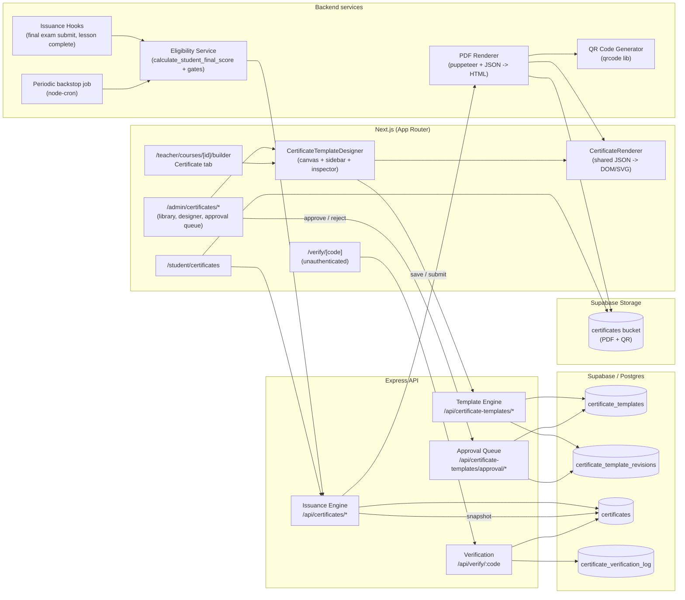

# Design Document: Certificate Designer Studio & Lifecycle System

## 1. Overview

This design replaces the existing basic certificate scaffolding with an end-to-end studio plus lifecycle system. The headline shift is two-fold: (a) the `CertificateTemplateDesigner` component becomes a true visual editor — fixed-aspect canvas, twelve dynamic field types, drag/resize/snap/keyboard nudge, alignment guides, full per-field styling, save fidelity guarantees, and a single render path shared with the issued PDF — and (b) the certificate backend grows a real lifecycle: per-template approval workflow, eligibility-gated issuance with manual override, durable PDF + QR storage, per-certificate template snapshots, a public verification portal, and a verification audit log. We build on the existing `certificates` and `certificate_templates` tables, the existing route surface in `backend/src/routes/certificates.ts` and `backend/src/modules/shared/routes/certificate.ts`, and the existing student/admin/teacher UI entry points; everything new is additive and migration-driven, with one feature flag flipping the new designer UI on top of the old one.

## 2. Architecture



Notes on the diagram:

- `Renderer` is one TypeScript module exported from `frontend/features/certificates/render/`. The browser preview uses it directly. The PDF path runs the same module inside puppeteer's page context (via `page.setContent` of an HTML scaffold that imports the renderer, hydrating the same JSON), so preview and PDF share one code path (Req 7.5, 12.3).
- `template_snapshot` on `certificates` is written at issuance time and is the *only* source the renderer consults when re-rendering a historical certificate (Req 4.7, 10.6).
- Verification is a thin path: lookup -> log -> respond, with rate limiting at the Express layer using the existing `express-rate-limit` patterns from `backend/src/middleware/rateLimiter.ts`.

## 3. Data Model & Schema Changes

The baseline schema lives in `backend/database/migrations/certificate_system.sql`. Below is the table-by-table delta. Every change is additive — no existing column is dropped or retyped — so the migration is non-breaking and can ship in Phase 1 ahead of any code change.

### 3.1 `certificates` — additions

| Column | Type | Notes |
| --- | --- | --- |
| `verification_code` | `VARCHAR(20) UNIQUE` | XXXX-XXXX-XXXX style, ≥60 bits entropy. Already referenced by `modules/shared/services/certificateService.ts`. |
| `qr_code_url` | `TEXT` | Data URL or storage URL for the embedded QR image. Already referenced in code. |
| `pdf_url` | `TEXT` | Public URL of the rendered PDF in the `certificates` Supabase bucket. |
| `completion_date` | `TIMESTAMPTZ` | When the student met all eligibility gates (distinct from `issued_at`). |
| `is_manual_override` | `BOOLEAN DEFAULT false` | True when an admin/teacher issued via the override path. |
| `override_by` | `UUID REFERENCES profiles(id)` | Admin/teacher who triggered the override. |
| `override_reason` | `TEXT` | Free-text reason; required when `is_manual_override = true`. |
| `verification_count` | `INTEGER DEFAULT 0` | Incremented on each successful public verification. |
| `last_verified_at` | `TIMESTAMPTZ` | Updated on each successful public verification. |
| `template_snapshot` | `JSONB` | Deep clone of the resolved Certificate_Template at issuance time (Req 4.7, 10.6). Renderer must consult this for historical certificates. |
| `revoked_reason` | `TEXT` | Existing migration uses `revoke_reason`; the shared service writes `revoked_reason`. The migration adds a generated/synonym column or we standardise on `revoke_reason` in code. **Decision:** standardise on `revoke_reason` in code; rename the one shared-service write site. |

### 3.2 `certificate_templates` — additions

| Column | Type | Notes |
| --- | --- | --- |
| `template_html` | `TEXT` | Optional pre-rendered HTML scaffold cache. **Decision:** Do *not* add this column. The HTML scaffold is generated deterministically from `template_data` by the shared renderer; storing it would create a second source of truth. The current code paths that read `template_html` (in `modules/shared/services/certificateService.ts`) will be updated to call the renderer. We keep `template_data` as the only structured source and document its schema (§4). |
| `approval_status` | `TEXT CHECK (approval_status IN ('approved','pending_approval','rejected','draft')) DEFAULT 'draft'` | Promoted from `template_data.approval_status` to a real column so the approval queue query is indexable. |
| `approved_by` | `UUID REFERENCES profiles(id)` | Set when admin approves. |
| `approved_at` | `TIMESTAMPTZ` | |
| `rejection_reason` | `TEXT` | Up to 1000 chars (Req 6.4); enforced at API layer. |
| `allow_teacher_editing` | `BOOLEAN DEFAULT false` | The Teacher_Editing_Toggle (Req 5.1). Promoted from `template_data.allow_teacher_edits`. |
| `parent_template_id` | `UUID REFERENCES certificate_templates(id) ON DELETE SET NULL` | When a teacher submits an edit we *do not* create a sibling row; we update the original. `parent_template_id` is reserved for future "fork" support and is nullable. The current revision pattern uses the `certificate_template_revisions` table below. |

Indexes added: `(approval_status)` and `(course_id, approval_status)` for the approval queue.

### 3.3 New: `certificate_template_revisions`

We need side-by-side previous-vs-pending comparison for the admin approval screen (Req 6.2). Two patterns were considered:

1. **Single-table with status flag** — keep one row per template and flip its `approval_status`; lose the prior approved version while edits are pending.
2. **Revision table** — keep one row per template (`certificate_templates`), and store every prior approved snapshot plus the current pending edit in `certificate_template_revisions`.

We pick (2). With (1), Req 5.6 ("the Issuance_Engine SHALL continue to use the previously approved version… while a Course_Template's `approval_status` is `pending_approval`") is impossible without storing two states. The revision table is small (one row per save), bounded (we can prune rejected revisions older than N days), and lets the approval UI render a true diff.

```sql
CREATE TABLE certificate_template_revisions (
  id                UUID PRIMARY KEY DEFAULT gen_random_uuid(),
  template_id       UUID NOT NULL REFERENCES certificate_templates(id) ON DELETE CASCADE,
  revision_number   INTEGER NOT NULL,
  template_data     JSONB  NOT NULL,
  status            TEXT   NOT NULL CHECK (status IN ('approved','pending_approval','rejected','superseded')),
  submitted_by      UUID REFERENCES profiles(id),
  submitted_at      TIMESTAMPTZ NOT NULL DEFAULT NOW(),
  reviewed_by       UUID REFERENCES profiles(id),
  reviewed_at       TIMESTAMPTZ,
  rejection_reason  TEXT,
  UNIQUE (template_id, revision_number)
);

CREATE INDEX idx_cert_template_rev_template ON certificate_template_revisions(template_id);
CREATE INDEX idx_cert_template_rev_status   ON certificate_template_revisions(status);
```

Semantics:

- The "current rendered" version of a template is the most recent revision with `status = 'approved'`.
- A teacher save creates a new revision with `status = 'pending_approval'`. Any prior `pending_approval` revision for the same template is moved to `status = 'superseded'`.
- An admin approve flips the pending revision to `approved`, prior `approved` revisions to `superseded`, and copies the new `template_data` onto the parent `certificate_templates` row (so existing reads keep working).
- An admin reject flips the pending revision to `rejected` and writes `rejection_reason`. The parent's `template_data` is not changed.
- Issuance always reads the parent row's `template_data` (which only ever holds an approved version), so the issuance hot path stays a single-table read.

### 3.4 New: `certificate_verification_log`

Already referenced by `modules/shared/services/certificateService.ts` but missing from the migration. Add it:

```sql
CREATE TABLE certificate_verification_log (
  id                    UUID PRIMARY KEY DEFAULT gen_random_uuid(),
  certificate_id        UUID REFERENCES certificates(id) ON DELETE SET NULL,
  verification_code     VARCHAR(20),
  verified_by_ip        INET,
  verified_by_user_agent TEXT,
  verification_result   TEXT NOT NULL CHECK (verification_result IN ('valid','invalid','revoked','expired')),
  verified_at           TIMESTAMPTZ NOT NULL DEFAULT NOW()
);

CREATE INDEX idx_cert_verify_log_cert    ON certificate_verification_log(certificate_id);
CREATE INDEX idx_cert_verify_log_time    ON certificate_verification_log(verified_at);
CREATE INDEX idx_cert_verify_log_ip_time ON certificate_verification_log(verified_by_ip, verified_at);
```

The IP+time index supports the rate-limit/abuse review query without scanning the table.

### 3.5 Proposed migration file (`backend/database/migrations/certificate_designer_studio.sql`, **not** committed yet)

```sql
-- 1. certificates additions
ALTER TABLE certificates
  ADD COLUMN IF NOT EXISTS verification_code   VARCHAR(20),
  ADD COLUMN IF NOT EXISTS qr_code_url         TEXT,
  ADD COLUMN IF NOT EXISTS pdf_url             TEXT,
  ADD COLUMN IF NOT EXISTS completion_date     TIMESTAMPTZ,
  ADD COLUMN IF NOT EXISTS is_manual_override  BOOLEAN DEFAULT false,
  ADD COLUMN IF NOT EXISTS override_by         UUID REFERENCES profiles(id),
  ADD COLUMN IF NOT EXISTS override_reason     TEXT,
  ADD COLUMN IF NOT EXISTS verification_count  INTEGER DEFAULT 0,
  ADD COLUMN IF NOT EXISTS last_verified_at    TIMESTAMPTZ,
  ADD COLUMN IF NOT EXISTS template_snapshot   JSONB;

CREATE UNIQUE INDEX IF NOT EXISTS idx_certificates_verification_code
  ON certificates(verification_code)
  WHERE verification_code IS NOT NULL;

-- 2. certificate_templates additions
ALTER TABLE certificate_templates
  ADD COLUMN IF NOT EXISTS approval_status        TEXT NOT NULL DEFAULT 'draft'
    CHECK (approval_status IN ('approved','pending_approval','rejected','draft')),
  ADD COLUMN IF NOT EXISTS approved_by            UUID REFERENCES profiles(id),
  ADD COLUMN IF NOT EXISTS approved_at            TIMESTAMPTZ,
  ADD COLUMN IF NOT EXISTS rejection_reason       TEXT,
  ADD COLUMN IF NOT EXISTS allow_teacher_editing  BOOLEAN DEFAULT false,
  ADD COLUMN IF NOT EXISTS parent_template_id     UUID REFERENCES certificate_templates(id) ON DELETE SET NULL;

CREATE INDEX IF NOT EXISTS idx_cert_tpl_approval_status ON certificate_templates(approval_status);
CREATE INDEX IF NOT EXISTS idx_cert_tpl_course_status   ON certificate_templates(course_id, approval_status);

-- 3. revisions table (DDL above)
-- 4. verification log table (DDL above)

-- 5. Existing-row backfill — run idempotently
UPDATE certificate_templates
SET approval_status = COALESCE(template_data->>'approval_status', 'approved')
WHERE approval_status = 'draft' AND template_data ? 'approval_status';

UPDATE certificate_templates
SET approval_status = 'approved'
WHERE approval_status = 'draft';  -- legacy rows assumed pre-approved

UPDATE certificate_templates
SET allow_teacher_editing = COALESCE((template_data->>'allow_teacher_edits')::boolean, false)
WHERE template_data ? 'allow_teacher_edits';
```

A separate one-shot Node script (`backend/scripts/backfill-cert-verification-codes.ts`) populates `verification_code` for any pre-existing certificate row, using `crypto.randomBytes` plus the same alphabet (`A-HJ-NP-Z2-9`) used in the shared service's `generateVerificationCode`. The script is idempotent and skips rows that already have a code.

## 4. Template JSON Schema

Single source of truth lives in `frontend/features/certificates/types/template.ts` and is re-exported to the backend via a shared TypeScript path (or duplicated and tested for parity). The JSON stored in `certificate_templates.template_data` and in `certificates.template_snapshot` follows this schema.

```ts
// frontend/features/certificates/types/template.ts

export type TemplateScope = 'global' | 'course';

export type ApprovalStatus = 'approved' | 'pending_approval' | 'rejected' | 'draft';

export type FieldType =
  | 'student_name'
  | 'course_title'
  | 'certificate_title'
  | 'completion_date'
  | 'issue_date'
  | 'instructor_name'
  | 'organization_name'
  | 'certificate_id'
  | 'verification_code'
  | 'qr_code'
  | 'grade'
  | 'custom_text';

export interface BaseField {
  id: string;                 // stable uuid, generated client-side
  type: FieldType;
  x: number;                  // canvas pixels, top-left origin
  y: number;
  width: number;
  height: number;
  fontFamily: string;         // e.g. 'Inter', 'Playfair Display'
  fontSize: number;           // 8..200, integer
  fontWeight: 300|400|500|600|700|800|900;
  color: string;              // #RRGGBB or #RRGGBBAA
  align: 'left' | 'center' | 'right' | 'justify';
  visible: boolean;
}

export interface StudentNameField       extends BaseField { type: 'student_name'; }
export interface CourseTitleField       extends BaseField { type: 'course_title'; }
export interface CertificateTitleField  extends BaseField { type: 'certificate_title'; text?: string; }
export interface CompletionDateField    extends BaseField { type: 'completion_date'; format?: string; /* date-fns token */ }
export interface IssueDateField         extends BaseField { type: 'issue_date';      format?: string; }
export interface InstructorNameField    extends BaseField { type: 'instructor_name'; }
export interface OrganizationNameField  extends BaseField { type: 'organization_name'; }
export interface CertificateIDField     extends BaseField { type: 'certificate_id';     prefix?: string; }
export interface VerificationCodeField  extends BaseField { type: 'verification_code';  prefix?: string; }
export interface QRCodeField            extends BaseField { type: 'qr_code';            errorCorrectionLevel?: 'L'|'M'|'Q'|'H'; }
export interface GradeField             extends BaseField { type: 'grade';              decimals?: 0|1|2; suffix?: string; /* default '%' */ }
export interface CustomTextField        extends BaseField { type: 'custom_text';        text: string; /* up to 500 chars */ }

export type CertificateField =
  | StudentNameField
  | CourseTitleField
  | CertificateTitleField
  | CompletionDateField
  | IssueDateField
  | InstructorNameField
  | OrganizationNameField
  | CertificateIDField
  | VerificationCodeField
  | QRCodeField
  | GradeField
  | CustomTextField;

export interface CertificateTemplate {
  schemaVersion: 1;
  id: string;
  name: string;
  scope: TemplateScope;
  course_id: string | null;
  background_image_url: string;
  canvas: { width: number; height: number };   // designer-fixed, e.g. 1754 x 1240 (A4 landscape @ 150dpi) or 960 x 620
  fields: CertificateField[];
  grid?: { size: number; snap: boolean };       // designer-only hint, not used by renderer
  approval: {
    status: ApprovalStatus;
    approved_by?: string;
    approved_at?: string;
    rejection_reason?: string;
    allow_teacher_editing: boolean;
  };
}
```

### 4.1 Round-trip serialization rule (Req 16.1, 16.2)

`serialize(template)` is `JSON.stringify` with sorted keys at every object level (using a stable replacer). `parse(json)` runs through a Zod schema (`templateSchema.parse(JSON.parse(json))`) and produces an in-memory `CertificateTemplate`. The pair is round-trip safe: `parse(serialize(t)).equals(t)` for all valid templates. This is the property tested by the round-trip property in §11.

### 4.2 Forward-compatibility rule (Req 16.4)

The Zod schema is permissive on read: unknown `FieldType` values are coerced to `{ type: 'unknown', ...rest }` and silently skipped by the renderer (with a `console.warn` once per session). The schema is strict on write: `serialize` rejects any field whose `type` is not in the discriminated union. New field types are added by extending the union plus the renderer; old templates without those fields parse cleanly because the union is a *list* not a *required field set*.

### 4.3 Sanitization (Req 14.6)

`CustomTextField.text` is stored verbatim in JSON, but the renderer escapes it before injecting into HTML/PDF. This is enforced by the renderer module (it never uses `dangerouslySetInnerHTML` on user content) and re-checked by a unit test.

## 5. API Design

All API paths are mounted on Express under `/api`. We extend the existing `backend/src/routes/certificates.ts` (which already mounts `/certificate-templates` and the teacher/student/admin endpoints) and `backend/src/modules/shared/routes/certificate.ts` (which already mounts `/verify/:code`). New endpoints follow the same `requireAuth` + `requireRole` middleware patterns.

### 5.1 Templates — Admin

| Method | Path | Auth | Request | Response | Reqs |
| --- | --- | --- | --- | --- | --- |
| GET | `/api/certificate-templates` | admin | `?scope=global|course&approval_status=...` | `{ templates: CertificateTemplate[] }` | 3.7 |
| POST | `/api/certificate-templates` | admin | `{ name, scope, course_id?, template_data, is_default?, allow_teacher_editing? }` | `{ template }` (201) | 3.1, 3.2 |
| PATCH | `/api/certificate-templates/:id` | admin | `{ name?, template_data?, allow_teacher_editing? }` | `{ template }` | 3.1, 5.1 |
| DELETE | `/api/certificate-templates/:id` | admin | – | `204` | 3.1, 4.6 |
| POST | `/api/certificate-templates/:id/set-default` | admin | – | `{ template }` (clears prior default in same scope) | 3.3, 3.4 |
| GET | `/api/certificate-templates/approval/queue` | admin | `?page=1&pageSize=25` | `{ revisions: TemplateRevision[], total }` | 6.1, 13.4 |
| GET | `/api/certificate-templates/:id/revisions` | admin | – | `{ current, pending?, history: TemplateRevision[] }` | 6.2 |
| POST | `/api/certificate-templates/:id/approve` | admin | `{ revisionId }` | `{ template, revision }` | 6.3 |
| POST | `/api/certificate-templates/:id/reject` | admin | `{ revisionId, reason }` (reason ≤ 1000 chars) | `{ template, revision }` | 6.4 |

### 5.2 Templates — Teacher

| Method | Path | Auth | Request | Response | Reqs |
| --- | --- | --- | --- | --- | --- |
| GET | `/api/certificate-templates` | teacher | `?courseId=<owned>` | `{ templates: CertificateTemplate[] }` filtered to owned + editable course templates only; rejection reason exposed when present | 5.2, 5.3, 6.6 |
| GET | `/api/certificate-templates/:id` | teacher | – | `{ template }` (403 if not owned) | 4.5 |
| PATCH | `/api/certificate-templates/:id` | teacher | `{ name?, template_data, submitForApproval: true }` | `{ template, revision }` (status `pending_approval`) | 5.4, 5.5 |

### 5.3 Templates — Shared

| Method | Path | Auth | Request | Response | Reqs |
| --- | --- | --- | --- | --- | --- |
| POST | `/api/certificate-templates/:id/render-preview` | admin or teacher (own) | `{ format: 'svg' \| 'png', mockData?: PreviewMockData }` | `{ data: base64 }` (server uses same renderer with mock data) | 7.5, 12.4 |

`PreviewMockData` defaults to a fixed sample (`John Doe`, `Sample Course`, today's date, `CERT-YYYY-XXXXXX`, `XXXX-XXXX-XXXX`).

### 5.4 Certificates — Issuance & Lifecycle

| Method | Path | Auth | Request | Response | Reqs |
| --- | --- | --- | --- | --- | --- |
| POST | `/api/teacher/courses/:courseId/students/:studentId/certificate` | teacher (owner) or admin | `{ override?: { reason } }` | `{ certificate }` (201) or `{ error, unmet: string[] }` | 8.1, 8.2, 8.6 |
| GET | `/api/teacher/courses/:courseId/certificates` | teacher (owner) or admin | – | `{ certificates }` | already exists |
| GET | `/api/student/certificates` | student | – | `{ certificates }` (active only) | 9.1 |
| GET | `/api/certificates/:id` | owner student or owner teacher or admin | – | `{ certificate }` | 9.2 |
| GET | `/api/certificates/:id/pdf` | owner student or admin | – | `application/pdf` stream from storage; 302 if `pdf_url` present | 9.4 |
| POST | `/api/certificates/:id/revoke` | admin (or course-owner teacher) | `{ reason }` | `{ certificate }` | 14.4 |
| POST | `/api/certificates/:id/reinstate` | admin | – | `{ certificate }` | – |

### 5.5 Public Verification

| Method | Path | Auth | Request | Response | Reqs |
| --- | --- | --- | --- | --- | --- |
| GET | `/api/verify/:code` | none, rate-limited (60/min/IP) | – | `{ status: 'valid'\|'invalid'\|'revoked'\|'expired', data?: PublicCertificateView }` | 11.1, 11.2, 11.7, 11.8, 14.5 |

`PublicCertificateView` (deliberately narrow, Req 11.7): `{ student_name, course_title, completion_date, certificate_id, instructor_name, organization_name, status, revoked_at?, revoke_reason? }`. Final score, email, internal IDs, IP/UA logs are *not* returned.

The handler always sets `Cache-Control: no-store` (Req 14.5) and writes a row to `certificate_verification_log` regardless of outcome.

The frontend page `frontend/app/verify/[code]/page.tsx` is a server component that calls this endpoint server-side (so even the Clerk middleware path-skip is explicit) and renders the result. It is the canonical landing page for QR scans (Req 11.6).

## 6. Rendering Pipeline

### 6.1 One render function, two contexts

We add `frontend/features/certificates/render/CertificateRenderer.tsx` and `frontend/features/certificates/render/renderToHTML.ts`. Both consume the same `(template: CertificateTemplate, data: CertificateRenderData)` and produce one of:

- **DOM tree** (`CertificateRenderer.tsx`, used by the in-browser preview and the in-page certificate viewer in `/student/certificates`).
- **HTML string** (`renderToHTML.ts`, used by the backend PDF pipeline).

Both implementations live in one module that exports two thin entry points around shared positioning math. The DOM renderer outputs `<div>`s with `position: absolute` and inline styles computed from each `CertificateField`. The HTML stringifier produces the same markup as static HTML using `react-dom/server`'s `renderToStaticMarkup`, so the *exact* same React tree is emitted in both contexts.

### 6.2 Where rendering happens

- **Browser preview**: pure React, runs inside the designer; updates within 16ms of any state change (Req 1.12).
- **Server PDF**: existing `CertificatePdfService` already uses Puppeteer (`backend/src/modules/certificate/services/certificatePdfService.ts`). We replace its hand-coded `generateCertificateHTML` with a call into `renderToHTML(template, data)` imported from the shared module. The HTML scaffold sets the page size to `template.canvas.width` × `template.canvas.height` at 1×, then `puppeteer.page.pdf({ width, height, printBackground: true })` produces a single-page PDF with no scaling. The viewport in `setViewport` is set to the same dimensions. This guarantees field coordinates round-trip without scaling drift (Req 7.6, 12.1).

### 6.3 QR generation

We keep `qrcode` (already in `backend/package.json`). At issuance, the engine computes `verificationUrl = ${VERIFICATION_PORTAL_URL}/${verification_code}`, calls `QRCode.toDataURL(verificationUrl, { errorCorrectionLevel, width: bbox })`, and substitutes the data URL into the QR field's `` `src`. The `errorCorrectionLevel` defaults to `'M'` and is overridable per field. The browser preview uses the same `qrcode` library client-side (added to `frontend/package.json`) with a fixed placeholder URL when the certificate hasn't been issued yet.

### 6.4 Font embedding

To make the preview match the PDF byte-for-byte we ship the same fonts in both contexts:

- A finite font set is whitelisted in `frontend/features/certificates/render/fonts.ts`: `Inter`, `Playfair Display`, `Roboto Slab`, `Lora`, `Montserrat`, `Cormorant Garamond`. The designer's font picker only offers these.
- The web preview loads them via Next.js `next/font/google` so they're self-hosted.
- The PDF renderer ships the same TTF/OTF files in `backend/src/modules/certificate/services/fonts/` and the HTML scaffold injects `@font-face` rules pointing at `file://` URLs (Puppeteer accepts those when `--disable-web-security` is set, which it already is via `--no-sandbox`).
- An integration test renders both paths for one template and asserts pixel parity using `pixelmatch` within a 2-pixel tolerance per field bounding box (Req 12.1).

### 6.5 Per-certificate template snapshot

At the point the issuance engine commits a certificate row, it also writes `template_snapshot = structuredClone(resolvedTemplate)` — the *fully resolved, approved* template after global/course/default-fallback resolution. Re-rendering a historical certificate (download, public verification view) reads only `template_snapshot` and never re-resolves through `certificate_templates`. This makes Req 4.7 and 10.6 straightforward.

## 7. Frontend Component Design

### 7.1 Component tree

```
<CertificateTemplateDesigner mode={admin|teacher} courseId? userId>
├── <DesignerHeader />            // breadcrumbs, save / submit, dirty indicator
├── <Toolbar />                   // add-field menu, undo/redo, grid toggle, snap toggle, zoom
├── <Sidebar>
│   ├── <TemplateList />          // when viewMode === 'library'
│   └── <FieldInspector />        // when a field is selected
├── <CanvasViewport>
│   ├── <GridOverlay />           // conditional (Req 1.8)
│   ├── <BackgroundImage />
│   ├── <DraggableField />[]      // one per CertificateField
│   ├── <AlignmentGuides />       // shown during drag (Req 1.10)
│   └── <SelectionMarquee />      // resize handles when selected
├── <PreviewPane />               // mock-data live render (Req 1.6, 12.4)
├── <KeyboardShortcuts />         // arrow nudge, delete, escape, etc.
└── <ApprovalPanel />             // shown to admin reviewing a pending revision (§7.5)
```

The existing `frontend/components/certificates/CertificateTemplateDesigner.tsx` is replaced wholesale; the public re-export at `frontend/features/certificates/components/CertificateTemplateDesigner.tsx` (which is just `export { default } from '@/components/certificates/CertificateTemplateDesigner'`) stays the same so callers in `app/admin/certificates/design/page.tsx` and `app/teacher/courses/[id]/builder/page.tsx` need no changes.

### 7.2 State management

We use **Zustand** (added to `frontend/package.json`) with one store per designer instance:

```ts
interface DesignerState {
  template: CertificateTemplate | null;
  selectedFieldId: string | null;
  grid: { size: number; snap: boolean; visible: boolean };
  zoom: number;
  history: { past: CertificateTemplate[]; future: CertificateTemplate[] };
  dirty: boolean;
  // actions
  setTemplate, addField, updateField, removeField, selectField,
  moveField, resizeField, toggleVisibility,
  undo, redo, save, submitForApproval, ...
}
```

Rationale: React local state was the existing approach and forces prop drilling between toolbar, inspector, canvas, and preview; Context re-renders too aggressively for 30 fps drag (Req 1.5); Redux is overkill. Zustand gives selector-based subscriptions (each `<DraggableField>` only subscribes to its own slice) which keeps drag at 60 fps even with 20+ fields. It is the smallest foreign dependency that solves the problem.

### 7.3 Drag/resize approach

We use **DOM mouse/pointer events directly** plus a tiny custom hook (`useDraggable`, `useResizable`) rather than `react-dnd` (designed for cross-component drop targets, overkill here) or `react-rnd` (good but adds ~15KB and its built-in snapping/grid doesn't match our alignment-guide spec). The custom hook listens to `pointerdown`/`pointermove`/`pointerup` on `document`, applies snap-to-grid math, and updates the Zustand store on each move. With Zustand's selector subscription model only the moved field re-renders. This hits the 30 fps target on the baseline machine (Req 1.5).

### 7.4 Shared UI state

| State | Owner | Read by |
| --- | --- | --- |
| selected field id | designer store | inspector, canvas selection ring, keyboard handler |
| grid size / snap / visible | designer store | canvas, toolbar, drag math |
| dirty flag | designer store | header (save button), navigation guard |
| zoom | designer store | canvas viewport, ruler |

### 7.5 Admin diff/compare UI

When an admin opens a template that has a `pending_approval` revision, the `<ApprovalPanel>` renders side-by-side: left = current approved template (`certificate_templates.template_data`), right = pending revision (`certificate_template_revisions[status='pending_approval'].template_data`). Both are rendered by the same `CertificateRenderer` with the same mock data. Below the previews we list a structured diff per field: added, removed, and changed properties (computed by a small JSON diff helper). The Approve / Reject buttons sit at the top of the panel; Reject opens a textarea bound to a 1000-char limit with an inline counter (Req 6.4).

## 8. Eligibility & Issuance Engine

### 8.1 Algorithm

```text
function isEligibleForCertificate(courseId, studentId) -> { eligible, unmet[] }:
  course = SELECT enable_certificates, passing_score FROM courses WHERE id = courseId
  if not course or not course.enable_certificates: return { eligible: false, unmet: ['certificates_disabled'] }

  enrollment = SELECT status FROM enrollments WHERE course_id = courseId AND student_id = studentId
  if not enrollment: return { eligible: false, unmet: ['not_enrolled'] }
  if enrollment.status != 'completed': missing.push('enrollment_not_completed')

  required_lessons    = SELECT id FROM lessons WHERE course_id = courseId AND is_required = true
  completed_lessons   = SELECT lesson_id FROM lesson_completions WHERE student_id = studentId
  if required_lessons \\ completed_lessons not empty: missing.push('lessons_incomplete')

  for each required_quiz in course:
    best = SELECT max(percentage) FROM quiz_attempts WHERE quiz_id = quiz.id AND student_id = studentId
    if best is null or best < quiz.passing_score: missing.push('quiz_failed:' + quiz.id)

  for each required_assignment:
    sub = SELECT grade FROM assignment_submissions WHERE assignment_id = a.id AND student_id = studentId AND grade IS NOT NULL
    if sub is null or (sub.grade / a.points) * 100 < a.passing_score: missing.push('assignment_failed:' + a.id)

  if course has final_exam:
    fes = SELECT grade FROM final_exam_submissions WHERE final_exam_id = fe.id AND student_id = studentId
    if fes is null or (fes.grade / fe.points) * 100 < fe.passing_score: missing.push('final_exam_failed')

  score = SELECT * FROM calculate_student_final_score(courseId, studentId)
  if not score.passed: missing.push('weighted_score_below_passing')

  // Course-defined extra eligibility (e.g. live attendance)
  for each gate in course.eligibility_conditions: if not gate.holds(studentId): missing.push(gate.name)

  return { eligible: missing.length === 0, unmet: missing }
```

The implementation lives in `backend/src/modules/certificate/services/eligibilityService.ts`. It returns a structured `unmet` list so the manual override UI can show the operator exactly what the student is missing (Req 8.2, 8.6).

`issueCertificate(courseId, studentId, opts)`:

1. If `opts.override` is not set, call `isEligibleForCertificate` and 400 with `unmet` if not eligible.
2. Call `calculate_student_final_score` to get the breakdown for `grade_breakdown` and `final_score`.
3. Resolve template: prefer `course_id = courseId AND approval_status = 'approved'`, else default global (`course_id IS NULL AND is_default = true AND approval_status = 'approved'`). Deep-clone into `template_snapshot`.
4. Generate `certificate_number` via `generate_certificate_number()` (existing). Generate `verification_code` via 60-bit crypto random over the safe alphabet, retrying on collision.
5. Insert `certificates` row (the existing `UNIQUE(course_id, student_id)` covers Req 8.7).
6. Render PDF via `CertificatePdfService.generateCertificatePDF({ template_snapshot, data })`, upload to Supabase Storage `certificates/<cert_id>.pdf`, write `pdf_url`.
7. Render QR data URL, write `qr_code_url`.
8. Return the certificate.

### 8.2 Hooks (when issuance fires)

Two real-time hooks are wired so eligibility is checked the moment the student's last gate clears:

- After `final_exam_submissions` insert/update with a non-null grade (server-side handler in `routes/finalExams.ts`).
- After the final required `lesson_completions` insert (server-side handler in `routes/courseProgress.ts`).

Both call `checkAndAwardCertificate(courseId, studentId)`, which is idempotent (Req 8.7). The 60-second SLA from Req 8.5 is met because both hooks run synchronously on the request that closes the last gate.

### 8.3 Periodic backstop job

A `node-cron` job at `backend/src/jobs/certificateBackstopJob.ts` runs every 15 minutes, finds enrollments with `status = 'completed'` and no certificate, and reruns `checkAndAwardCertificate`. This catches any cases where a hook missed (race condition, server restart, manual grade entry).

### 8.4 Manual override path

The teacher/admin UI calls `POST /api/teacher/courses/:courseId/students/:studentId/certificate` with `{ override: { reason } }`. The handler skips `isEligibleForCertificate` *only* when `override` is present and `reason` is non-empty, and writes `is_manual_override = true`, `override_by = req.auth.userId`, `override_reason = reason`. Everything else (ID/code generation, PDF, QR, snapshot) is identical (Req 8.6).

## 9. Public Verification Portal

### 9.1 Frontend route

A new server component `frontend/app/verify/[code]/page.tsx`:

```tsx
// /verify/[code]/page.tsx (server component)
export const dynamic = 'force-dynamic';

export default async function VerifyPage({ params }: { params: { code: string } }) {
  const res = await fetch(`${process.env.API_URL}/api/verify/${params.code}`, {
    cache: 'no-store',
    headers: { 'x-forwarded-for': headers().get('x-forwarded-for') ?? '' },
  });
  const result = await res.json();
  return <VerificationResultView result={result} />;
}
```

The route is added to `frontend/middleware.ts` as a public route so Clerk doesn't redirect to sign-in.

### 9.2 Backend handler

Already wired at `GET /api/verify/:code` (in `modules/shared/routes/certificate.ts`). We extend it with:

- A dedicated `verifyLimiter = rateLimit({ windowMs: 60_000, max: 60, keyGenerator: ip-from-trust-proxy })` mounted before the route (Req 11.8). Reuses `express-rate-limit` already in deps.
- `Cache-Control: no-store` on every response (Req 14.5).
- The narrow public response shape from §5.5 (Req 11.7).
- Logging: every call writes a `certificate_verification_log` row with `verification_result ∈ {valid, invalid, revoked, expired}` and `verified_by_ip`/`verified_by_user_agent`. On a `valid` lookup, the certificate's `verification_count` is bumped and `last_verified_at` is set.

### 9.3 Logging strategy

We deliberately log every attempt (including `invalid`) with the verifier's IP. This supports two queries: per-certificate verification history (admin "verification stats" tab) and IP-based abuse review (e.g. enumeration attempts hitting the rate limit). The IP+time index on the log table makes the abuse query cheap.

## 10. Authorization Matrix

| Endpoint | Admin | Teacher (course owner, `allow_teacher_editing=true`) | Teacher (other) | Student (owner) | Student (other) | Public |
| --- | --- | --- | --- | --- | --- | --- |
| GET `/api/certificate-templates` (global) | ✓ | ✗ | ✗ | ✗ | ✗ | ✗ |
| GET `/api/certificate-templates?courseId=X` | ✓ | ✓ (own course) | ✗ (403) | ✗ | ✗ | ✗ |
| POST `/api/certificate-templates` (global) | ✓ | ✗ (403) | ✗ | ✗ | ✗ | ✗ |
| POST `/api/certificate-templates` (course) | ✓ | ✓ (own) | ✗ | ✗ | ✗ | ✗ |
| PATCH `/api/certificate-templates/:id` | ✓ | ✓ (own + toggle on) → status `pending_approval` | ✗ | ✗ | ✗ | ✗ |
| DELETE `/api/certificate-templates/:id` | ✓ | ✗ | ✗ | ✗ | ✗ | ✗ |
| POST `/api/certificate-templates/:id/set-default` | ✓ | ✗ (403) | ✗ | ✗ | ✗ | ✗ |
| GET `/api/certificate-templates/approval/queue` | ✓ | ✗ (403) | ✗ | ✗ | ✗ | ✗ |
| POST `/api/certificate-templates/:id/approve\|reject` | ✓ | ✗ (403) | ✗ | ✗ | ✗ | ✗ |
| POST `/api/certificate-templates/:id/render-preview` | ✓ | ✓ (own) | ✗ | ✗ | ✗ | ✗ |
| POST `…/students/:studentId/certificate` (issue/override) | ✓ | ✓ (own course) | ✗ | ✗ | ✗ | ✗ |
| POST `/api/certificates/:id/revoke` | ✓ | ✓ (own course) | ✗ | ✗ | ✗ | ✗ |
| POST `/api/certificates/:id/reinstate` | ✓ | ✗ | ✗ | ✗ | ✗ | ✗ |
| GET `/api/student/certificates` | ✓ (own only via this endpoint) | – | – | ✓ | ✗ (only own returned) | ✗ |
| GET `/api/certificates/:id` | ✓ | ✓ (own course) | ✗ | ✓ (own only) | ✗ | ✗ |
| GET `/api/certificates/:id/pdf` | ✓ | ✓ (own course) | ✗ | ✓ (own only) | ✗ | ✗ |
| GET `/api/verify/:code` | ✓ | ✓ | ✓ | ✓ | ✓ | ✓ (rate-limited) |

Matrix satisfies Reqs **3.8, 4.5, 5.2, 5.3, 5.4, 6.7, 8.1, 9.7, 14.3**. Every check is enforced server-side; the frontend hides controls cosmetically but is not the security boundary.

## 11. Correctness Properties


*A property is a characteristic or behavior that should hold true across all valid executions of a system — essentially, a formal statement about what the system should do. Properties serve as the bridge between human-readable specifications and machine-verifiable correctness guarantees.*

After classifying every acceptance criterion and reflecting to remove redundancy, twelve distinct correctness properties remain. They cover the testable parts of the spec; smoke tests, integration tests, and performance benchmarks cover the rest (see §12).

### Property 1: Template serialization round-trip

*For any* valid `CertificateTemplate` value `t`, `parse(serialize(t))` deeply equals `t` and `serialize(parse(serialize(t)))` is byte-identical to `serialize(t)`.

**Validates: Requirements 2.2, 2.3, 7.1, 7.2, 7.3, 7.4, 16.1, 16.2**

### Property 2: Forward-compatible parser

*For any* valid `CertificateTemplate` value `t`, removing any subset of optional or future fields from `serialize(t)` and parsing the result yields a template with those fields absent and no thrown error.

**Validates: Requirement 16.4**

### Property 3: Malformed-input parser robustness

*For any* string `s` that is not a valid serialized template, `parse(s)` throws a `TemplateParseError` carrying a non-empty `.path` describing the offending JSON pointer, and no other exception class escapes the parser.

**Validates: Requirement 16.3**

### Property 4: Field style validators

*For any* candidate field record, the validator accepts the record iff every style value is in its declared range: `fontSize` is an integer in `[8, 200]`, `fontWeight` is in `{300,400,500,600,700,800,900}`, `color` matches `/^#[0-9A-Fa-f]{6}([0-9A-Fa-f]{2})?$/`, `align ∈ {left,center,right,justify}`, `CustomTextField.text.length ≤ 500`, and the uploaded background satisfies `mimeType ∈ {png,jpeg,webp} ∧ size ≤ 10MB`.

**Validates: Requirements 1.4, 2.4, 2.5, 2.6, 2.7, 2.9**

### Property 5: Designer geometry reducers are pure

*For any* `CertificateTemplate`, any selected field, and any sequence of move/resize/snap/nudge/arrow-key actions, the resulting field geometry equals the deterministic application of the corresponding pure reducer (`snap-to-grid` rounds to multiples of `grid.size`; arrow-key nudge applies a `±grid.size` (or `±1px` when snap is off) delta on the matching axis; resize handles produce `width', height'` clamped to `[1, canvas.size - origin]`); and an alignment guide for an axis is shown iff the field's center on that axis is within 8px of the canvas center on that axis.

**Validates: Requirements 1.6, 1.7, 1.9, 1.10, 1.11**

### Property 6: Render is a deterministic function of (template, data)

*For any* valid `CertificateTemplate` `t` and any `CertificateRenderData` `d`, the DOM render and the HTML render produce structurally identical output (same field set, same per-field text, same absolute positions in CSS pixels) — and the rendered field set excludes every field with `visible = false`, applies the value-substitution rules (Grade formatted to 1 decimal place + `%`, dates formatted via the field's `format`, QR src equals `qrcode.toDataURL(d.verificationUrl)` when present and the placeholder otherwise), and renders empty content (zero-width text, bbox preserved) when the runtime value is null or empty.

**Validates: Requirements 2.8, 2.10, 2.11, 2.12, 3.6, 7.5, 7.6, 12.1, 12.2, 12.4, 15.2**

### Property 7: Template resolution is a pure function of (course, templates, revisions)

*For any* course `c` and any set of templates and revisions, `resolveTemplate(c)` returns: the latest `approved` revision of the course-scoped template if one exists; otherwise the `template_data` of the unique global template with `is_default = true ∧ approval_status = 'approved'`; otherwise `null`. While a course template has a `pending_approval` revision, `resolveTemplate` ignores it and falls back to the previously-approved version (or the global default). Rejected revisions are never returned.

**Validates: Requirements 3.3, 3.4, 3.5, 4.3, 4.6, 5.6, 6.5**

### Property 8: Per-certificate snapshot stability

*For any* certificate `c` issued at time `t0` with snapshot `S = c.template_snapshot`, and any sequence of edits, approvals, rejections, or deletions applied to the source `certificate_templates` row at any time `t > t0`, `render(c, currentData(c))` is byte-identical to `render({ ...c, template_snapshot: S }, currentData(c))`.

**Validates: Requirements 4.7, 10.3, 10.4, 10.5, 10.6**

### Property 9: Eligibility predicate

*For any* `(course, student, courseGates)` input, `isEligibleForCertificate` returns `eligible: true` iff every one of the six gates in §8.1 holds simultaneously, and `unmet` is exactly the set of gate identifiers whose predicate returned false. Calling `checkAndAwardCertificate` twice for the same `(courseId, studentId)` results in at most one row in `certificates` and no error on the second call (idempotence + the `UNIQUE(course_id, student_id)` constraint).

**Validates: Requirements 8.1, 8.2, 8.7**

### Property 10: Issuance artifact completeness

*For any* successful issuance (auto or manual override), the resulting `certificates` row has non-null `certificate_number`, `verification_code`, `qr_code_url`, `pdf_url`, `template_snapshot`, `final_score`, `grade_breakdown`, `completion_date`, and `issued_at`; manual-override issuances additionally have `is_manual_override = true`, non-null `override_by`, and non-empty `override_reason`.

**Validates: Requirements 8.4, 8.6, 10.1, 10.2**

### Property 11: Verification code uniqueness and entropy

*For any* batch of `N ≥ 2` certificates issued through `issueCertificate` (with or without simulated collision), all `verification_code` values are pairwise distinct, all `certificate_number` values are pairwise distinct, and the bit-length of the random component of `verification_code` is at least 60.

**Validates: Requirements 8.3, 14.1, 14.2**

### Property 12: Public verification correctness

*For any* certificate `c` and any sequence of `verify(code)` calls, the response satisfies: (i) `status = 'valid'` iff `c.status = 'awarded' ∧ c.expires_at IS NULL ∨ c.expires_at > now()`; `status = 'revoked'` iff `c.status = 'revoked'`; `status = 'expired'` iff `c.expires_at ≤ now()`; `status = 'invalid'` iff no certificate matches the code; (ii) the response object's keys are a subset of the public whitelist `{student_name, course_title, completion_date, certificate_id, instructor_name, organization_name, status, revoked_at, revoke_reason}`; (iii) every call inserts exactly one row into `certificate_verification_log` with the matching `verification_result`; and (iv) for `valid` calls, `c.verification_count` is incremented by exactly 1 and `c.last_verified_at` is set to a value `≥` the call time.

**Validates: Requirements 11.2, 11.3, 11.4, 11.5, 11.7, 14.4**

### Property 13: Authorization matrix invariant

*For any* role `r ∈ {admin, teacher, student, public}`, any endpoint `e` from §10, any actor identity (with optional course-ownership flag), and any request body, the server's allow/deny decision matches the entry in §10. In particular: only admins can write global templates, set defaults, approve, or reject; teachers can read or write a course template iff they own the course AND `allow_teacher_editing = true`; students can read only their own certificates; the public verification endpoint is allowed for all callers but responds within the whitelist of Property 12.

**Validates: Requirements 3.8, 4.2, 4.5, 5.1, 5.2, 5.3, 6.7, 9.7, 14.3**

### Property 14: Custom text sanitization

*For any* string `s` (including known XSS payloads such as `<script>alert(1)</script>`, `">`, and Unicode bidi tricks), inserting `s` as the `text` of a `CustomTextField` and rendering the template produces HTML in which `s` is HTML-encoded — `<`, `>`, `&`, `"`, `'` are escaped — and contains no executable script, event handler, or active content derived from `s`.

**Validates: Requirement 14.6**

### Property 15: Approval queue pagination

*For any* set of `N` templates with `approval_status = 'pending_approval'` and any `(page, pageSize)` with `pageSize = 25`, the response returns at most 25 items, starts at offset `(page - 1) × 25`, exposes `total = N`, and the union of items across all pages with no duplicates equals the full pending set.

**Validates: Requirement 13.4**

## 12. Error Handling

| Failure | Where it surfaces | Behavior |
| --- | --- | --- |
| Background image too large or wrong type | Designer upload | Inline error identifying the rule (Req 1.4); no upload attempt sent. Server-side re-check returns 400 with the same rule string. |
| Save fails to persist any field | `PATCH /certificate-templates/:id` | The handler runs the write inside a Supabase transaction-equivalent (single update). On error, return HTTP 500 with `{ error: 'persist_failed', detail: <message>, fieldPath: <if available> }` and never silently drop a field (Req 7.7). |
| Template parse error on read | Renderer / API | `TemplateParseError` with `.path` for the offending JSON pointer. The API returns 500 with `{ error: 'template_parse_error', path }`. The designer renders an error state but doesn't crash. |
| Eligibility check fails (not eligible) | `POST .../certificate` (no override) | 400 with `{ error: 'not_eligible', unmet: string[] }` (Req 8.2). |
| Manual override without reason | `POST .../certificate` with `override` | 400 with `{ error: 'override_reason_required' }`. |
| Code/ID collision at issuance | `issueCertificate` | Caught by retry loop (Req 14.2). After 10 retries, 500 with `{ error: 'code_collision' }` (effectively impossible at 60 bits). |
| PDF render failure | Issuance pipeline | The certificate row is rolled back (delete + revert storage upload) so we don't leave a row without a usable PDF. Operator sees 500. |
| QR generation failure | Issuance pipeline | Same as PDF render failure. |
| Verification code unknown | `GET /api/verify/:code` | 200 with `{ status: 'invalid' }` and a log row with `verification_result = 'invalid'` (Req 11.3). We deliberately do *not* return 404 because that leaks existence; a uniform 200 with a status string is harder to enumerate. |
| Verification rate limit hit | Same | 429 from `express-rate-limit` (Req 11.8). The limiter's standard headers are returned. |
| Teacher edits a non-editable or non-owned template | `PATCH /certificate-templates/:id` | 403 with `{ error: 'forbidden' }`. |
| Approval queue empty / no pending revision for an id | `POST .../approve\|reject` | 404 with `{ error: 'no_pending_revision' }`. |
| Concurrent template edits (admin + teacher) | `PATCH /certificate-templates/:id` | We use optimistic concurrency: the patch body must include `expectedRevisionNumber`. Mismatch returns 409 with `{ error: 'revision_conflict', currentRevision }`. |

All errors return JSON with a stable `error` string suitable for switching in the UI; human-readable messages are derived client-side via `react-hot-toast`.

## 13. Testing Strategy

We use a dual approach: property-based tests for universal invariants (cheap and high-coverage) and example-based unit/integration tests for specific scenarios, role/auth wiring, and external services.

### 13.1 Tooling

- **Backend unit + property**: `jest` (already wired) + `fast-check` (already in `backend/package.json`).
- **Frontend unit + property**: `jest` + `@testing-library/react` + `fast-check` (added to `frontend/package.json`).
- **Frontend integration / visual**: Playwright (added). One Playwright project covers the designer drag/keyboard flow, the approval flow, and the public verification flow.
- **Visual regression**: `pixelmatch` over a fixed set of templates; preview PNG vs PDF first-page PNG, with a 2-pixel-per-field tolerance.
- **Load**: `k6` scripts in `backend/load/` (already present); add `k6-cert-verify-100rps.js` for Req 13.3.

### 13.2 Property tests (one per property in §11)

Each property test lives in `backend/src/__tests__/certificate/` or `frontend/__tests__/certificates/`. Each test is tagged with a tag comment of the form `// Feature: certificate-designer-studio, Property N: <property text>` and configured to run a minimum of 100 iterations via `fc.assert(prop, { numRuns: 100 })`. Properties 6, 7, 8, 12, 13 share generators (`templateArb`, `fieldArb`, `dataArb`, `roleArb`) defined in a shared `arbitraries.ts`.

Properties whose underlying operation is expensive (PDF rendering, headless browser) run with `numRuns: 25` and a default timeout — Property 6 (full pixel parity) is one of those. The cheaper logical sub-property (DOM render equals string render under same data) runs at the full 100.

### 13.3 Example-based unit tests

- Empty-state student certificates page (Req 9.6).
- Reject / approve happy path with a real revision row (Req 6.3).
- Each authorization-matrix cell that the property tests don't already cover (one per role × endpoint).
- The eligibility hook on `final_exam_submissions` insert.

### 13.4 Integration tests

- `teacher-edit → pending → admin-approve → re-render` end-to-end (DB + API).
- Manual-override path (DB + API + storage upload mock).
- Public verification: valid cert returns whitelist; invalid cert returns invalid + logs; revoked cert returns revoked.
- 60-second auto-issue: simulate final exam grade insert and assert a certificate row exists within 60s.

### 13.5 Visual regression

A single Playwright test renders one canonical template at canvas size 1754×1240 in both contexts (browser preview, server PDF). It captures the preview PNG, the PDF first-page PNG (via `pdf-poppler` or `pdf-to-img`), runs `pixelmatch`, and asserts that no field's bounding box has any pixel diff > 2 pixels offset (Req 12.1). Three templates are included to cover all 12 field types.

### 13.6 Why PBT applies here

PBT is the right tool for this feature because the testable surface is dominated by:

- a JSON serializer/parser pair (Property 1, 2, 3),
- pure validators (Property 4),
- pure reducers for designer geometry (Property 5),
- a deterministic renderer (Property 6),
- a pure resolution function over a small relational model (Property 7),
- a snapshot invariant (Property 8),
- a boolean predicate over generable inputs (Property 9),
- structural invariants over generated database states (Properties 10, 11, 12, 13, 15).

The heavy I/O parts (Supabase Storage upload, Puppeteer PDF rendering, k6 load scripts) are deliberately tested with example/integration tests, not properties, because input variation provides little additional coverage there. This split is the §11 + §13 contract.

## 14. Migration Strategy & Rollout

Five-phase rollout. Each phase is independently reversible up to the next.

**Phase 1 — Schema additions (non-breaking).** Apply `certificate_designer_studio.sql` (§3.5), creating new columns, the revisions table, and the verification log table. Backfill `approval_status` and `allow_teacher_editing` from `template_data`. No code change ships in this phase. Existing rows are now tagged: `certificate_templates.approval_status = 'approved'` (legacy assumed pre-approved), `allow_teacher_editing = false`. Existing `certificates` rows have `verification_code IS NULL` until Phase 3 backfill.

**Phase 2 — Designer redesign behind a feature flag.** Ship the new `CertificateTemplateDesigner` (Zustand store, drag/resize, alignment, field types, save fidelity). Gate it behind `NEXT_PUBLIC_FEATURE_CERT_DESIGNER_V2 = '1'`. Both pages (`/admin/certificates/design` and the teacher builder Certificate tab) read the flag and pick the new or old component. Internal admins flip the flag for their own session via a query param to QA. The new template JSON is stored alongside the legacy `placeholders` shape; the renderer migrates legacy on read by mapping the six `placeholders` keys to `CertificateField` records.

**Phase 3 — Issuance engine wiring.** Ship eligibility hooks, auto-issuance with snapshot writing, manual override, code generation with proper entropy. Run the one-shot `backfill-cert-verification-codes.ts` to populate `verification_code` for legacy `certificates` rows. Run a second one-shot to render-and-upload PDFs for legacy certs that lack `pdf_url` (using the legacy template if needed). The auto-issue cron backstop (§8.3) is registered.

**Phase 4 — Public verification portal.** Ship `/verify/[code]` (frontend + Clerk public-route bypass), the rate limiter, and the verification log writes. Update the QR generation URL to point at the live `/verify/...` route. Existing legacy QR images keep working because their codes were backfilled in Phase 3.

**Phase 5 — Flip the flag, deprecate old paths.** Set `NEXT_PUBLIC_FEATURE_CERT_DESIGNER_V2 = '1'` by default. Remove legacy `placeholders`-only handling from the renderer (legacy templates are auto-migrated into the new shape on first read in Phase 2; this phase removes the read-path branch). Mark `template_data.approval_status` and `template_data.allow_teacher_edits` as soft-deprecated (still read for one release, then dropped).

### 14.1 Existing-row handling

| Table | Pre-existing row | Behavior |
| --- | --- | --- |
| `certificate_templates` | `template_data.approval_status` set | Promoted to column in Phase 1; `template_data` keeps the field for one release for safe rollback. |
| `certificate_templates` | `template_data.approval_status` not set | Defaults to `'approved'` (legacy assumed sane). |
| `certificate_templates` | `template_data.allow_teacher_edits` set | Promoted to `allow_teacher_editing` column. |
| `certificate_templates` | `template_data.placeholders` only (legacy 6-key shape) | Renderer converts to `CertificateField[]` on read; on next save the new shape is written. |
| `certificates` | `verification_code IS NULL` | Backfilled by `backfill-cert-verification-codes.ts` in Phase 3. |
| `certificates` | `pdf_url IS NULL` | Backfilled by render-and-upload script in Phase 3; rendered using the certificate's snapshot if present, else the resolved template, else the default global. |
| `certificates` | `template_snapshot IS NULL` | Filled in Phase 3 with whatever template would resolve at backfill time. Documented as a one-time approximation; future issuances always write the snapshot atomically. |

### 14.2 Rollback

Phase 1 is non-breaking and never rolled back. Phases 2–5 are flag-flipped: setting `FEATURE_CERT_DESIGNER_V2 = '0'` reverts the UI; the new schema columns are unused by the legacy code path. The new tables (`certificate_template_revisions`, `certificate_verification_log`) accumulate data even on rollback, which is fine.

## 15. Open Questions / Risks

The following decisions need product input before implementation. Reasonable defaults are listed.

1. **Font set.** Whitelist of six fonts (Inter, Playfair Display, Roboto Slab, Lora, Montserrat, Cormorant Garamond) is proposed as a default. Confirm this list, or expand it, before bundling fonts in `backend/src/modules/certificate/services/fonts/`. Risk: shipping fonts with restrictive licenses.
2. **Maximum background image size.** Spec says 10 MB; acceptable for designers but we will up-resample to 4× of canvas DPI for PDF. Confirm whether to also enforce a maximum *dimension* (e.g. ≤ 6000×6000 px) to guard the PDF renderer.
3. **Share targets.** Web Share API on supported browsers + a copyable URL is proposed. Should we also add explicit deep-links for LinkedIn ("Add to Profile") and Twitter? Each adds extra UI complexity.
4. **Share URL TLD / custom domain.** The QR resolves to `${VERIFICATION_PORTAL_URL}/${code}`. Today this points at the main app domain. Do we want a short, brandable verification domain (e.g. `verify.example.com`)?
5. **Multi-language certificate support.** The course already supports `course_language`. Should the designer expose a `language` per template (which would change date formatting and direction) or per field (allowing bilingual layouts)? Proposed default: per-template, single language; revisit if requested.
6. **Certificate expiration.** The spec leaves expiration out (no `expires_at` column today). Property 12 references it as a possibility; we should explicitly decide whether to add an `expires_at` column and the corresponding policy UI.
7. **Course-level eligibility gates beyond the six listed.** Req 8.1 mentions "minimum live attendance" as an example. We need a concrete schema for `courses.eligibility_conditions` (e.g. `JSONB`) before implementing the gate plug-in. Default: ship without it in v1 and add it in a follow-up.
8. **Storage retention.** Should revoked certificates' PDFs be deleted from storage or retained? Proposed default: retained, since they may be needed for audit; the URL is just no longer surfaced.
9. **PDF page size flexibility.** Today we lock to A4 landscape. Do we want US Letter or custom sizes? Easy to add but expands the fidelity test surface.
10. **Approval queue ownership.** All admins see the same approval queue. Do we want assignment / claim semantics (one admin owns a review)? Proposed default: shared queue, no claims, for v1.
